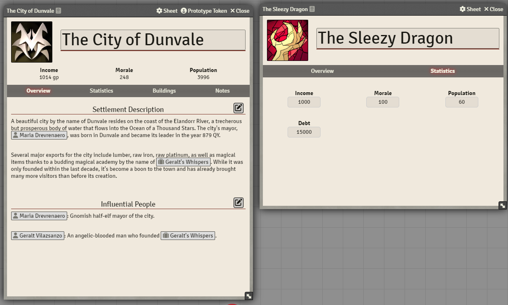

# Overview

Settlement Sheets is a system agnostic module for FoundryVTT games that allows gamemasters to keep track of individual settlements like actor sheets, including the ability to keep track of population, wealth, buildings, and much more!

## Donation Information
If you'd like to donate to me, you can through [Paypal](https://www.paypal.com/donate/?hosted_button_id=T5ZD4T9PSZZVA) or [Ko-Fi](https://ko-fi.com/veilzakinsemi).

## Licensing
This repository is licensed under [GPLv3](https://www.gnu.org/licenses/gpl-3.0.en.html), meaning that you are free to use the code for any purpose so long as you disclose the source, state any changes you have made, use the same license and provide a notice of the license in any works that you publish.
